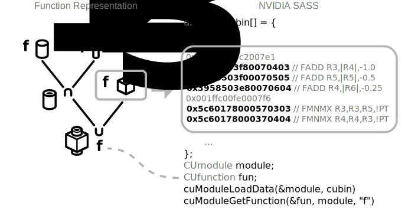

# fast-csg

A compiler for functional representations (see e.g. OpenSCAD, libfive, Hyperfun) that directly generates executable bytecode instructions for GPU architectures.

It gives you the benefit of fast tree evaluation as the tree structure is compiled into optimized machine code instructions (which makes the program compute-limited, not memory bandwidth-limited), while avoiding the long compile times that you would get by compiling to an intermediate target, such as GLSL, PTX, CUDA or NVVM IR.

Unlike NVIDIA's closed-source PTX->SASS compiler, we focus on compilation speed, aiming for sub-millisecond time from compilation start to having the kernel uploaded to the GPU and ready to run.

Possible applications:

* Fast and parallelized hypothesis generation and testing, for e.g. program synthesis or 3D reconstruction.
* GPU-accelerated visualization where you can live edit the CSG tree structure with instant feedback

## Project status

This project is currently in limbo. I'm open-sourcing it in the event that anyone finds some parts of it useful. To that end, here's a list of stuff that's in here:

* CSG tree grammar and interpreter (see [src/frep.h](src/frep.h))
* Complete CSG->GLSL compiler (see [src/backend_glsl.h](src/backend_glsl.h))
* Complete CSG->PTX compiler (see [src/backend_ptx.h](src/backend_ptx.h))
* Partial CSG->SASS 6.x compiler (missing Cubin linking stage)

Naturally, implementing a custom SASS compiler is difficult, as NVIDIA does not publically document the ISA and their PTX compiler is closed-source. With the help of Scott Gray's MaxAs (a reverse engineering of the Maxwell SASS), I was able to implement a rudimentary compiler for compute capability 6.x devices (Maxwell, Pascal families). Although the succeeding families Volta and Turing have not made huge changes to the ISA, it's a tedious task to implement backends for all of them.

Nonetheless, you can find
* Scheduler and register allocation ([src/sass_6_x/backend.h](src/sass_6_x/backend.h))
* Bytecode generation ([src/sass_6_x/bytecode.h](src/sass_6_x/bytecode.h))
